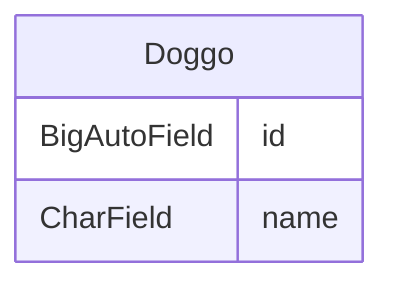
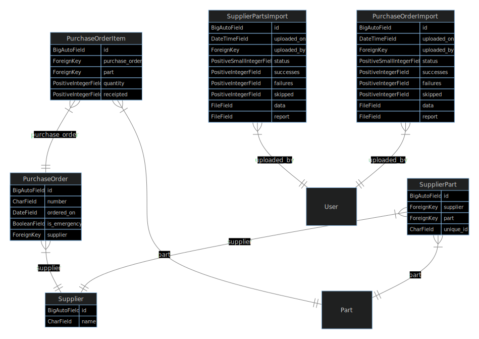

# django-diagram
Generate an Entity Relationship Diagram for a Django project in Mermaid format


## Installation

You can install via pip:

```bash
pip install django-diagram
```

## Usage

Navigate to the directory containing your Django project (the folder containing manage.py) and run:

```bash
python -m django_diagram
```

The following options are available:

`--settings=project.settings.local` - The dotted path to the settings module
(either this option must be provided or the `DJANGO_SETTINGS_MODULE` environment
variable must be set)

`--title="My Title"` - The title to use for the diagram

`--app=app_name` - Restrict to only a particular Django app. If there are
related models outside of this app they will be represented just by a single box
rather than showing all the model attributes (see the example below).

`--output=diagram.txt` - The output file to write the mermaid definition,
if this option is not provided the output will be written to stdout

### Rendering the diagram

For a list of integrations and plugins that will render the diagram from the
mermaid definition see [the mermaid documentation](https://mermaid.js.org/ecosystem/integrations.html).

For example, many [Markdown](https://www.markdownguide.org/basic-syntax/) renderers
(including [GitHub](https://docs.github.com/en/get-started/writing-on-github/working-with-advanced-formatting/creating-diagrams))
will render the diagram if you wrap the mermaid definition in a code block with the language set to `mermaid`:

````

````

## Example


